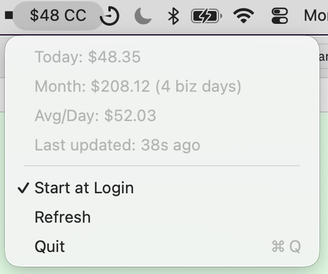

# ClaudeCost

`ClaudeCost` is a standalone macOS menubar app that shows your Claude Code spend for today and the current month. It refreshes every 60s.



## Requirements

- macOS 13 or newer
- `mise`

## Install

From this directory:

```sh
mise trust
mise install
mise run install
```

The install task copies the bundle to `~/Applications/ClaudeCost.app` and launches it.
It also enables "Open at Login" by default the first time the app runs.

For local development:

```sh
mise run dev
```

`mise` manages the Bun toolchain for this project and uses the system Swift toolchain. The build tasks install the local `ccusage` dependency, compile the helper, and stage both binaries into `ClaudeCost.app`.

App bundle version metadata is sourced from `tooling/version.txt`.

## Development Tasks

```sh
mise run fmt
mise run lint
mise run test
mise run check
```

- `fmt` formats the Swift sources and helper-side files
- `lint` runs `swift-format` linting and Prettier checks
- `test` runs the local Swift test harness
- `check` runs linting, tests, and verifies the release app bundle
